本笔记结合 GAMES204 的 Introduction 部分以及 Human Visual System、Color and Display 章节，主要用于建立对计算成像（Computational Imaging）的整体认识。课程首先从传统摄影和针孔相机出发，说明成像的本质是将真实三维世界中的光学信息经过光学系统、传感器和后续处理转换为可观测的数据；随后进一步引出计算成像与传统摄影、计算摄影之间的区别，即计算成像不仅关注“如何处理已经拍到的图像”，还会主动设计光学系统、传感器、照明方式和编码策略，使现实世界中的空间、时间、角度、光谱、偏振等信息能够以更适合后续恢复的形式被记录下来。从统一数学视角看，整个过程可以表示为由物理模型定义的 forward problem，再根据 measurement 求解 inverse problem，并借助 image prior、regularization、optimization 或 learning-based methods 来恢复目标信息。Introduction 还通过 HDR、低光摄影、偏振成像、CT/PET、light field、hyperspectral imaging、NLOS、ToF、transient imaging 等例子说明计算成像的应用范围。Human Visual System 与 Color 部分则补充了成像系统最终面向“人眼感知”这一层基础，介绍人眼视觉范围、动态范围、对比度、视网膜与锥细胞响应，以及光谱功率分布、颜色匹配、色彩空间和显示颜色等内容，从而建立起从真实光场、相机采集、计算恢复到人眼最终感知的完整链路。

## 1. Introduction

### 从小孔成像pinhole camera到photography.

假设一个物点 \(P\) 发出的光向所有方向传播，但小孔只允许非常窄的一束光通过，于是这个物点最终只会落到屏幕上的一个位置。

几何上就是：

$$ \frac{x'}{x}=-\frac{f}{Z} $$

或者计算机视觉里你更熟悉的：

x=f
Z
X
	​

,y=f
Z
Y
	​
最初 photography 的词源大概就是：

$$ photo = light,\qquad graphy=writing $$

所以可以理解为：

$$ \boxed{\text{writing with light}} $$

也就是“用光写作”。 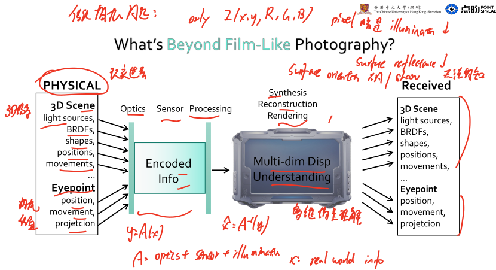 

### 什么是计算成像(computational imaging)?

Computational Imaging (Photography)
optically encode
information about the real world
in images aimed for
computational decoding
Ø Computational Display
computationally encode
information so that it can be
optically decoded
to form images to be presented to a user  
探索：

$$ \boxed{ \text{new optics} } $$

比如：

coded aperture
diffractive optical element
metasurface
phase mask
$$ \boxed{\text{new sensors}} $$

例如：

event camera
SPAD
polarization sensor
ToF
spectral sensor
$$ \boxed{\text{new illumination}} $$

例如：

structured light
laser
coded illumination
active illumination

以及：

$$ \boxed{\text{new algorithms}} $$

例如：

inverse optimization
compressed sensing
deconvolution
deep learning
differentiable rendering

Computational Imaging
Ø With Optics Optimized for Target
Computational Photography
Ø Traditional Optics
Ø Mostly used for mobile camera
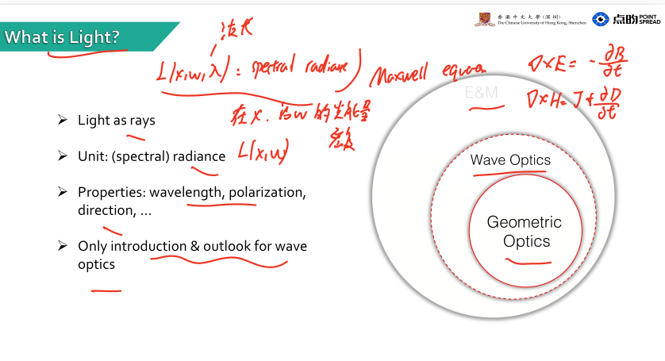

### Applications and examples of computational Imaging
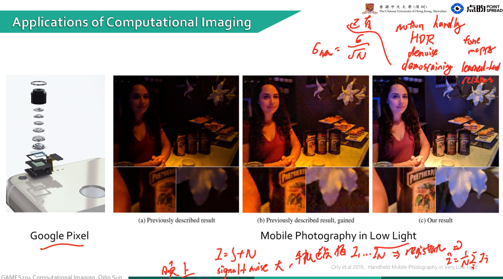
google pixel手机夜景。

低光下：

$$ I=S+N $$

signal 很弱，noise 很明显。

手机会连续拍：

$$ I_1,I_2,\dots,I_N $$

对齐：

$$ \text{registration} $$

然后融合：

$$ \hat I= \frac1N\sum_i I_i $$

简单情况下，独立噪声标准差大致降为：

$$ \sigma_{\text{new}} = \frac{\sigma}{\sqrt N} $$

现代算法当然复杂很多，还会做：

motion handling
HDR
denoise
demosaicing
tone mapping
learning-based reconstruction

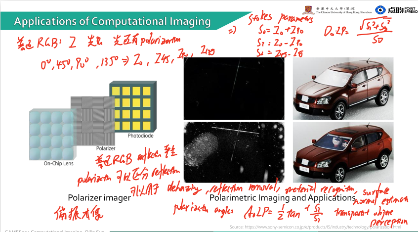
17. Polarizer Imager

下一页是偏振成像。

普通 RGB sensor 主要测：

$$ I $$

即光强。

但是光还有 polarization。

例如传感器前面放不同方向的 polarizer：

$$ 0^\circ,\quad 45^\circ,\quad 90^\circ,\quad 135^\circ $$

测：

$$ I_0,I_{45},I_{90},I_{135} $$

然后可以恢复 Stokes parameters：

$$ S_0=I_0+I_{90} $$ $$ S_1=I_0-I_{90} $$ $$ S_2=I_{45}-I_{135} $$

进而：

$$ DoLP= \frac{\sqrt{S_1^2+S_2^2}}{S_0} $$

和 polarization angle：

$$ AoLP= \frac12 \tan^{-1}\frac{S_2}{S_1} $$

这些信息 RGB 看不到。

18. 偏振有什么用？

slide 右边展示的例子就是：

普通 RGB：

$$ \text{reflection严重} $$

但 polarization 可以区分反射特性，因此可用于：

$$ \text{dehazing} $$ $$ \text{reflection removal} $$ $$ \text{material recognition} $$ $$ \text{surface normal estimation} $$ $$ \text{transparent object perception} $$

汽车视觉里也很有价值。

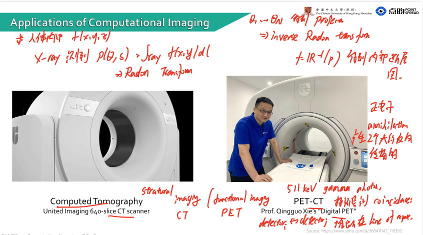19. CT：Computed Tomography

CT 是 computational imaging 的超级经典例子。

你真正想知道的是人体内部：

$$ f(x,y,z) $$

但你根本不能直接“拍摄”内部。

X-ray 穿过人体时测到的是：

$$ p(\theta,s) = \int_{\text{ray}} f(x,y)\,dl $$

也就是说测到的是一条 ray 上的积分。

这叫：

$$ \boxed{\text{Radon Transform}} $$

很多角度：

$$ \theta_1,\theta_2,\dots $$

得到 projection，然后做 inverse Radon transform：

$$ f = \mathcal R^{-1}(p) $$

于是得到内部断层图。

这就是非常标准的：

$$ \boxed{ measurement + inverse problem = image } $$

注意：

CT 得到的“图像”本来就不是相机直接看到的，而是计算出来的。

这就是为什么它叫 Computed Tomography。

20. PET-CT

PET 检测的是体内放射性 tracer。

正电子 annihilation 后会产生两个大约反向传播的：

$$ 511\,keV $$

gamma photon。

探测器测 coincidence：

$$ \text{detector}_i \leftrightarrow \text{detector}_j $$

推断事件大概发生在这条 line of response 上。

然后再通过 reconstruction 恢复：

$$ 3D\ activity\ distribution $$

PET 更偏：

$$ \text{functional imaging} $$

CT 更偏：

$$ \text{structural imaging} $$

两者融合：

PET-CT
	
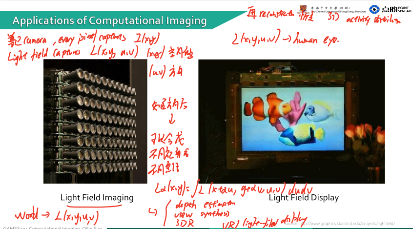 Light Field Imaging

这个对 Graphics / Computational Imaging 特别重要。

普通 camera 每个 pixel 大概只记录：

$$ I(x,y) $$

也就是落到这个 pixel 的所有方向光的总和。

Light field 想记录：

$$ \boxed{L(x,y,u,v)} $$

其中：

$$ (x,y) $$

表示空间位置，

$$ (u,v) $$

表示方向。

所以普通图像是 2D，而 light field 可以认为是 4D。

22. 为什么 light field 有用？

因为知道光线方向后，可以事后重新合成不同视角或者不同焦距。

例如 refocusing：

$$ I_\alpha(x,y) = \int L(x+\alpha u,y+\alpha v,u,v)\,du\,dv $$

所以可以：

$$ \boxed{\text{shoot first, focus later}} $$

还可以：

depth estimation
view synthesis
3D reconstruction
VR / light-field display
23. Light Field Display

这是反方向：

Light Field Camera：

$$ \text{world} \rightarrow L(x,y,u,v) $$

Light Field Display：

$$ L(x,y,u,v) \rightarrow \text{human eye} $$

普通显示器基本只控制：

$$ RGB(x,y) $$

而 light-field display 还希望控制：

$$ direction $$

所以不同观看方向看到不同内容，可以产生真正的 3D parallax。

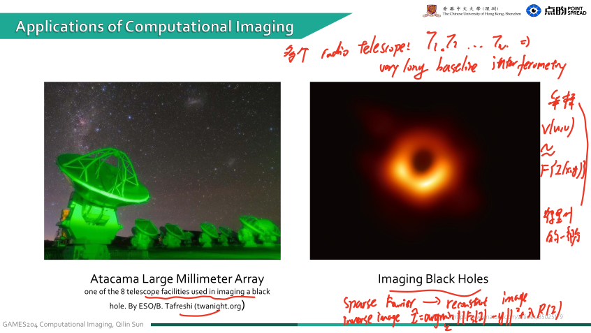 Black Hole Imaging

那张黑洞照片也是 computational imaging 的绝佳例子。

Event Horizon Telescope 并不是一个巨大的“相机镜头”。

而是全球多个 radio telescope：

$$ T_1,T_2,\dots,T_N $$

组合成：

$$ \boxed{\text{Very Long Baseline Interferometry}} $$

它实际上采样的是图像 Fourier domain 的一部分：

$$ V(u,v) \approx \mathcal F\{I(x,y)\} $$

但采样极其稀疏。

因此问题变成：

$$ \text{sparse Fourier measurements} \rightarrow \text{reconstruct image} $$

也就是典型 inverse imaging：

$$ \hat I = \arg\min_I \|\mathcal F_S(I)-y\|^2 + \lambda R(I) $$

最后才得到大家看到的黑洞图像。

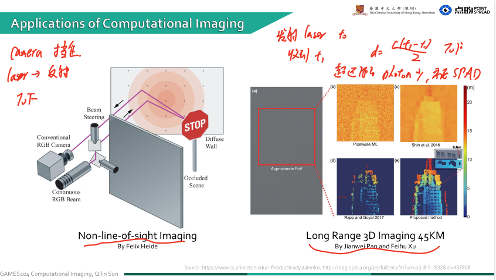 Non-Line-of-Sight Imaging

这个是非常典型的“传统相机不可能做到”的东西。

场景：

$$ camera $$

看不到被墙挡住的物体。

但是：

$$ laser \rightarrow wall \rightarrow hidden\ object \rightarrow wall \rightarrow camera $$

光经过多次反射还是会回来。

如果使用超快 detector，例如：

$$ \boxed{\text{SPAD}} $$

可以测 photon time-of-flight。

光走的距离：

$$ d=ct $$

所以不同时间到达的 photon 对应不同路径长度。

通过大量 transient measurement：

$$ I(x,y,t) $$

再求 inverse problem，可以恢复墙后物体。

所以这叫：

$$ \boxed{\text{seeing around corners}} $$
26. Long-range 3D Imaging

slide 上写：

$$ 45\,km $$

这种系统通常也是主动光学 + photon detector。

发射 laser：

$$ t_0 $$

接收到：

$$ t_1 $$

则距离：

$$ d= \frac{c(t_1-t_0)}2 $$

为什么除以 2？

因为：

$$ camera\rightarrow object\rightarrow camera $$

光走了往返两倍距离。

超远距离情况下 photon 极少，所以需要：

$$ SPAD $$

或类似 single-photon detector，再配合 statistical reconstruction。

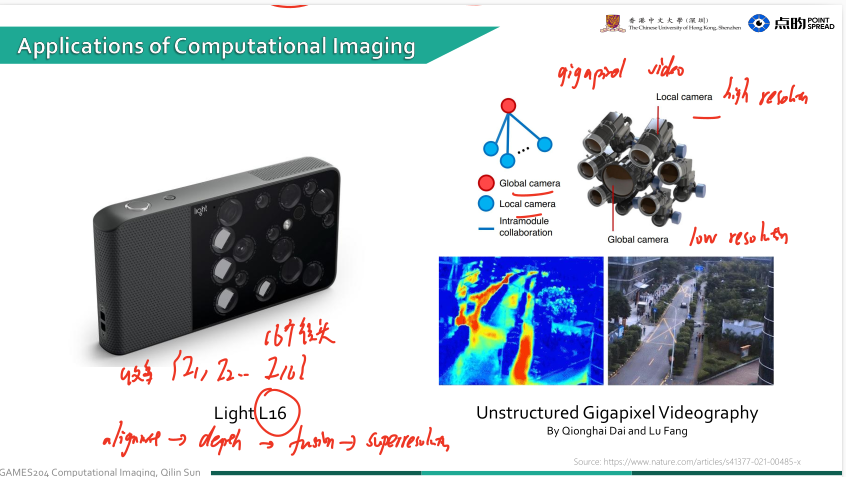 第一张左边是 Light L16。

它不是传统的：

$$ \text{one lens}\rightarrow\text{one sensor} $$

而是很多不同焦距、不同位置的小相机组成 camera array。

每个 camera 得到：

$$ I_i(x,y) $$

因为不同 camera 的：

viewpoint 不一样
focal length 不一样
exposure 可以不一样

所以最终收集的是很多不同的 measurement：

$$ \{I_1,I_2,\dots,I_N\} $$

然后软件做：

$$ \text{alignment} \rightarrow \text{depth estimation} \rightarrow \text{fusion} \rightarrow \text{super-resolution} $$

最后产生一张高质量照片。

它就是很典型的：

$$ \boxed{\text{hardware coding + computational reconstruction}} $$

而不是单纯“镜头越大越好”。

2. Unstructured Gigapixel Videography

右边那个很夸张的多相机系统是在做 Gigapixel video。

核心思想是：

我不要求一台相机拍完整场景，而让很多相机分别负责不同区域。

图里有：

Global camera：拍整体，低分辨率
Local cameras：拍局部，高分辨率

可以理解成：

$$ I_G=\text{global view} $$

以及：

$$ I_{L_1},I_{L_2},\dots $$

然后把局部高分辨率信息注册到 global camera：

$$ T_i: I_{L_i}\rightarrow I_G $$

最终得到巨大分辨率的视频：

$$ \boxed{\text{many cameras}\rightarrow\text{gigapixel video}} $$

它和普通 stitching 相似，但难点更大，因为是动态视频，还要处理：

camera calibration
synchronization
temporal consistency
overlap registration
occlusion

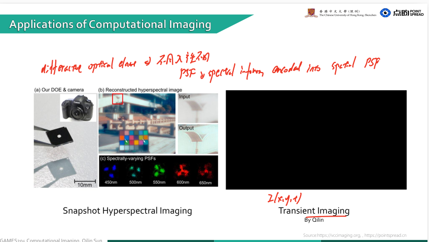 Snapshot Hyperspectral Imaging

这一页非常重要。

普通 RGB camera：

$$ I(x,y,c),\qquad c\in\{R,G,B\} $$

每个 pixel 只有三个通道。

但真实世界光谱其实是：

$$ I(x,y,\lambda) $$

例如：

$$ \lambda=450,451,\dots,650\,nm $$

所以 hyperspectral image 是一个三维 data cube：

$$ \boxed{H\times W\times N_\lambda} $$

可能不是 3 个 channel，而是几十甚至几百个 wavelength channel。

为什么要“Snapshot”？

传统 hyperspectral camera 经常需要：

$$ \text{scan wavelength} $$

或者：

$$ \text{scan spatial line} $$

所以一幅 hyperspectral image 不是一次曝光得到的。

Snapshot hyperspectral imaging 希望：

$$ \boxed{\text{one shot}\rightarrow H\times W\times N_\lambda} $$

怎么做到？

就是在 optics 里做 coding。

图里的 DOE：

$$ \boxed{\text{Diffractive Optical Element}} $$

会让不同波长产生不同 PSF：

$$ h_\lambda(x,y) $$

比如：

$$ 450nm\rightarrow h_{450} $$ $$ 550nm\rightarrow h_{550} $$ $$ 650nm\rightarrow h_{650} $$

sensor 得到：

$$ y(x,y) = \sum_\lambda x_\lambda*h_\lambda $$

然后 reconstruction algorithm 反推：

$$ \{x_\lambda\} $$

这就是：

$$ \boxed{\text{spectral information encoded into spatial PSF}} $$

非常标准的 computational imaging。

4. Transient Imaging

Transient imaging 不只是记录：

$$ I(x,y) $$

而是记录：

$$ \boxed{I(x,y,t)} $$

也就是：

光什么时候到达 sensor。

普通相机把 exposure window 内的 photons 全加起来：

$$ I(x,y) = \int I(x,y,t)\,dt $$

所以时间维度丢掉了。

Transient camera 则尽量保留：

$$ t $$

于是可以看到光在空间中传播的过程。

因为：

$$ d=ct $$

所以时间信息直接对应距离信息。

例如 round-trip ToF：

$$ d=\frac{ct}{2} $$

这就是很多：

ToF camera
NLOS imaging
LiDAR
light-in-flight imaging

的基础。

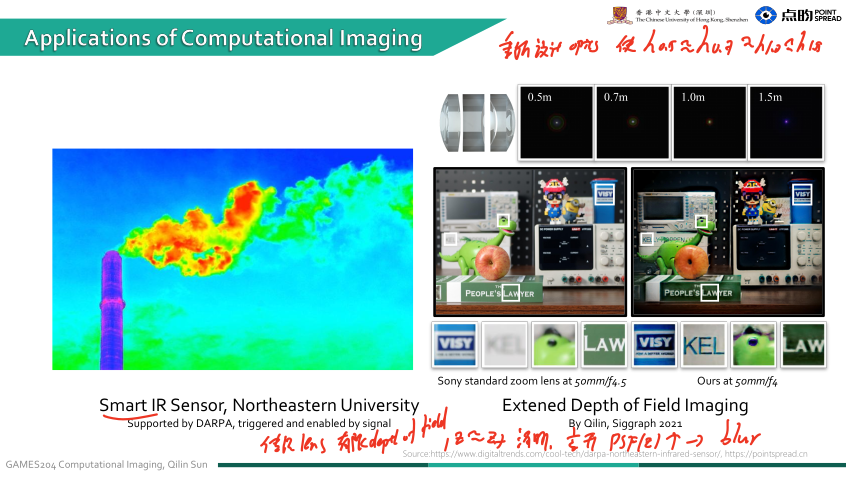 Smart IR Sensor

左边那个烟囱热图讲的是 infrared imaging。

可见光 sensor 测：

$$ 400-700\,nm $$

而 IR sensor 测更长波长。

物体温度对应 thermal radiation，因此 IR camera 可以看到肉眼看不到的：

$$ \boxed{\text{temperature / thermal radiation}} $$

图里说：

triggered and enabled by signal

意思很可能是 sensor 不是一直高速工作，而可以针对感兴趣信号触发，实现：

low power
event-driven sensing
high dynamic range
smart sensing

所以 computational imaging 不只是算法，sensor architecture 本身也可以重新设计。

6. Extended Depth of Field

右边是老师自己的工作之一：

$$ \boxed{\text{Extended Depth of Field Imaging}} $$

传统 lens 有有限的 depth of field。

只有某个 depth 附近：

$$ z\approx z_f $$

清晰。

离开这个 depth：

$$ PSF(z) $$

会迅速变大，于是 blur。

图里 Sony lens 在：

$$ 0.5m,\quad0.7m,\quad1.0m,\quad1.5m $$

PSF 明显变化。

他们的想法是什么？

重新设计 optics，使：

$$ PSF(z) $$

在不同深度下尽量保持某种稳定、可逆的结构：

$$ h_{0.5m}\approx h_{0.7m}\approx h_{1m}\approx h_{1.5m} $$

或者至少让 reconstruction network 容易 invert。

于是：

$$ \text{scene} \xrightarrow{\text{custom lens}} \text{coded blur} \xrightarrow{\text{deconvolution/network}} \text{sharp image} $$

这又是：

$$ \boxed{\text{optics-algorithm co-design}} $$

所以你上一轮看到的 differentiable lens 正是干这种事情的。

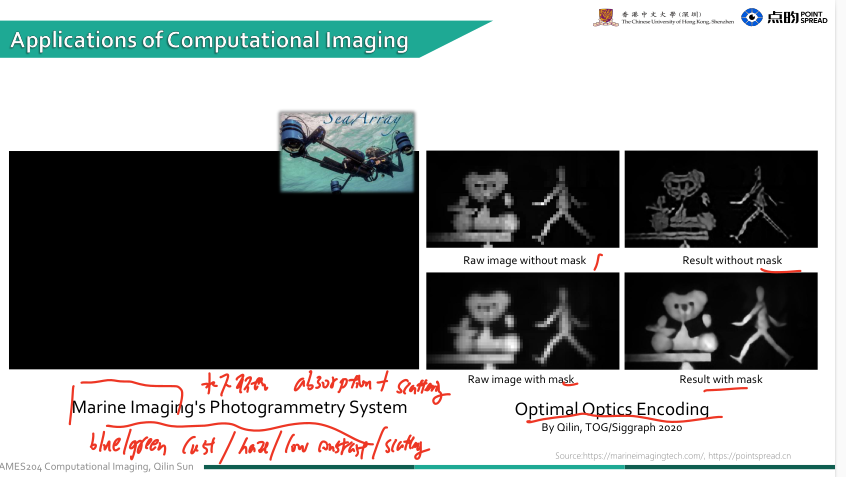Marine Imaging / Photogrammetry

Marine imaging 最大的问题是水下环境：

$$ \text{absorption}+\text{scattering} $$

尤其不同 wavelength 衰减不同。

红光通常衰减得比蓝绿光严重。

所以 underwater image 常出现：

blue/green cast
haze
low contrast
scattering

如果做 photogrammetry，还希望：

$$ \text{multiple images} \rightarrow 3D geometry $$

这时候不仅要做普通 SfM/MVS，还要考虑水下成像模型。

8. Optimal Optics Encoding

右边非常值得理解。

图中：

without mask

raw image 看起来比较正常，但 reconstruction 后效果可能很差。

with mask

raw image 反而看起来更模糊、更奇怪，但 reconstruction 后更好。

这就是 computational imaging 最反直觉的思想：

$$ \boxed{\text{Sensor 上看到的图，不必是“好看的图”。}} $$

真正目标是：

$$ \boxed{\text{最终任务结果最好}} $$

假设 measurement：

$$ y=A_\theta x $$

传统 optics 的目标可能是：

$$ A_\theta x\approx x $$

也就是 sensor image 尽量像 scene。

但 computational imaging 可以直接优化：

$$ \min_{\theta,\phi} L(f_\phi(A_\theta x),x) $$

所以：

$$ A_\theta x $$

本身非常丑也没关系，只要：

$$ f_\phi(A_\theta x) $$

恢复得好。

这就是 optimal optical encoding。

9. Terahertz Imaging with Metasurface

Terahertz：

$$ 10^{11}-10^{13}\,Hz $$

大致位于：

$$ \text{microwave} \leftrightarrow \text{infrared} $$

之间。

它有一些很特别的材料穿透性质，所以可以用于：

security inspection
material characterization
biomedical sensing
spectroscopy

图里使用：

$$ \boxed{\text{metasurface}} $$

metasurface 是由亚波长结构组成的人工光学表面。

通过设计单元：

$$ \phi(x,y) $$

可以控制：

phase
amplitude
polarization
direction

相当于把传统厚 lens 的功能压到一个薄层上。

10. 11 TOPS Optical CNN

右边是更激进的方向：

$$ \boxed{\text{用光来做神经网络计算}} $$

普通 convolution：

$$ y[k] = \sum_i w_i x_{k-i} $$

在电子芯片里需要大量：

$$ MAC=\text{multiply-accumulate} $$

但是 optics 本身能天然实现很多 linear operation。

例如 Fourier optics：

$$ \mathcal F(x) $$

lens 本身就可以完成 Fourier transform。

或者用：

wavelength
time
spatial mode

并行编码。

于是 optical system 可以做：

$$ y=W x $$

甚至 convolution。

11 TOPS：

$$ 11\times10^{12} $$

operations per second。

它利用光的优势：

$$ \boxed{\text{massive parallelism}} $$

因为很多 wavelength / spatial channel 可以同时传播。

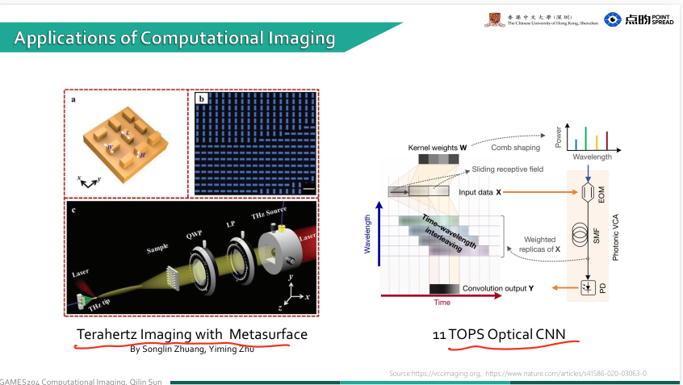

### 如何计算 计算方法

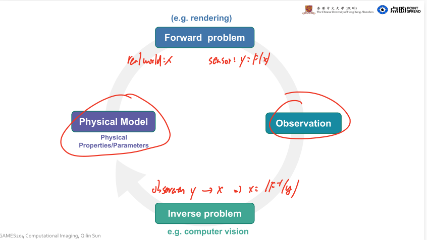 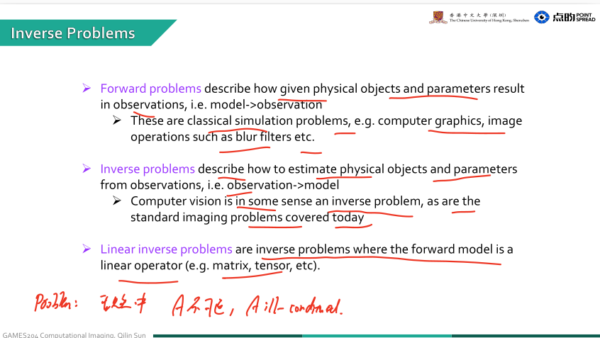

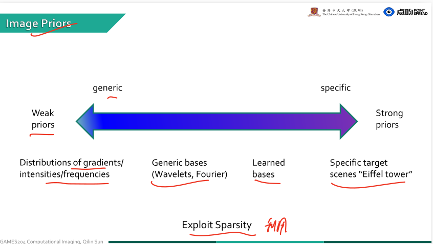 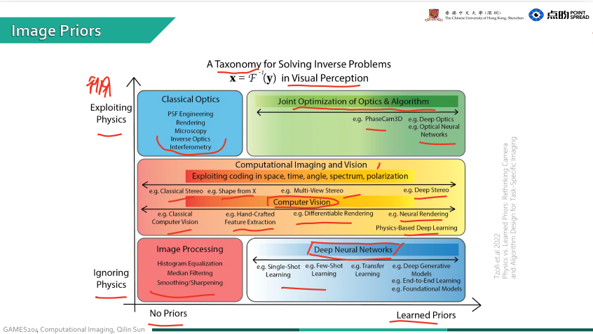 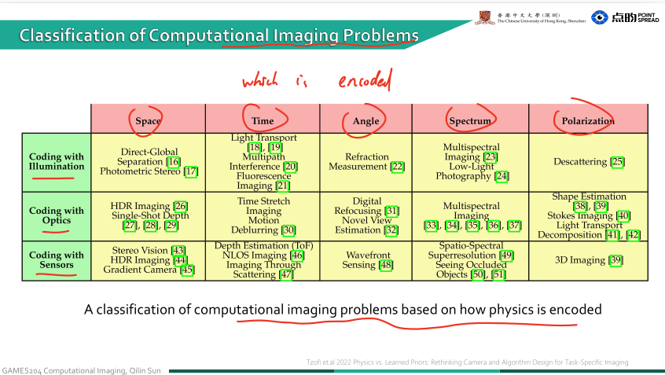

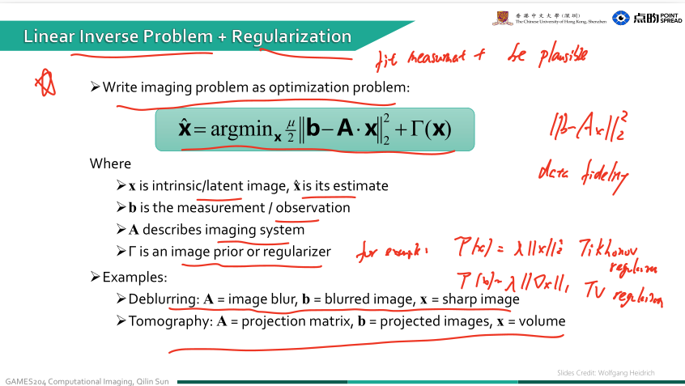