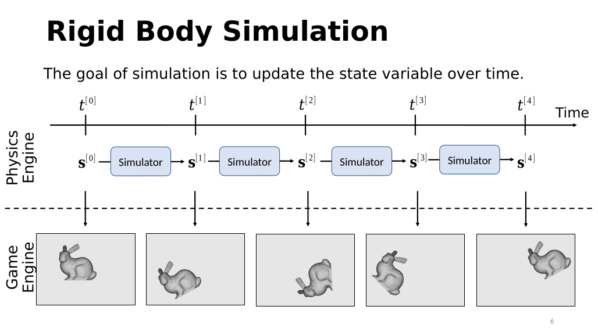
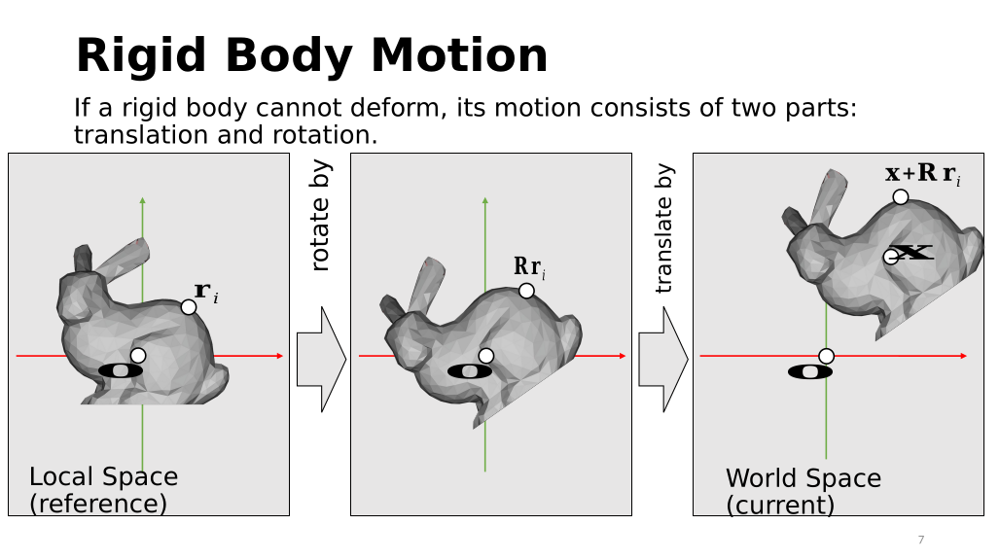
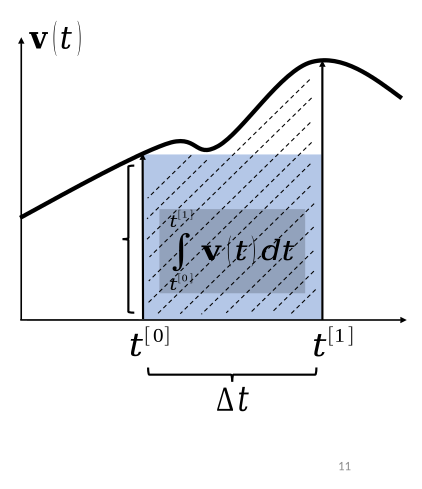

## 1. Rigid Body Dynamics

### 1.1 Rigid Body

什么是刚体？ 刚体是一种理想化的物体模型，严格定义是：
A rigid body is a system of material points in a 3D Euclidean space \(\mathbb{R}^{3}\), where the Euclidean distance between any two points remains invariant under any motion.
也就是说，假设刚体内部任意两个点为为 \(i\) 和 \(j\)，它们在时刻 \(t\) 的位置分别是

p
i
	​

(t),p
j
	​

(t),

那么刚体必须满足那么刚体必须满足

$$ \boxed{ \|\mathbf p_i(t)-\mathbf p_j(t)\| = \text{constant} } $$

或者更严格地写成

∥p
i
	​

(t)−p
j
	​

(t)∥=∥p
i
	​

(0)−p
j
	​

(0)∥
	​
对物体中任意两个点、任意时刻都成立。

In virtual worlds, we want to simulate rigid body motions as well.


The goal of simulation is to update the state variable over time. 
Quiz: What is **state variable** ? System theory 
 因为刚体不能形变，刚体运动完全可以分解为rotation + Translation.

为了描述一个刚体，首先给物体建立自己的坐标系，称为：

$$ \boxed{\text{Local Space}} $$

也常叫：

object space；
body space；
local coordinate system。

PPT 左图中，兔子处于一个 reference configuration。

假设兔子上的某个点为 \(i\)，它在 local space 中的位置记作

$$ \boxed{\mathbf r_i} $$

例如：

$$ \mathbf r_i= \begin{bmatrix} r_x\\ r_y\\ r_z \end{bmatrix}. $$

它描述的是：

点 \(i\) 相对于刚体自身参考坐标系的位置。

对于一个刚体，因为物体内部不会发生形变，所以

$$ \boxed{\mathbf r_i} $$

可以保持固定。

这正是使用 local space 的意义：

把物体自身的几何形状和物体在世界中的运动分开。

物体本身的 geometry 存在 local space 中，而整个物体如何运动，则由另外的 transformation 描述。

8. Rotation

接下来考虑整个物体旋转。

设

$$ \mathbf R $$

是刚体当前的 rotation。

那么 local point

$$ \mathbf r_i $$

旋转之后变成

$$ \boxed{ \mathbf R\mathbf r_i } $$

这里 \(\mathbf R\) 是三维 rotation matrix：

$$ \mathbf R\in SO(3). $$

所谓

$$ SO(3) $$

即三维特殊正交群：

$$ SO(3) = \left\{ R\in\mathbb R^{3\times3} \mid R^TR=I,\; \det R=1 \right\}. $$

其中

$$ R^TR=I $$

保证旋转保持长度和角度，

而

$$ \det R=1 $$

排除 reflection。

因此 rotation 不会改变两个点之间的距离，这与 rigid body 的定义一致。

9. Translation

旋转之后，还可以把整个物体平移。

设刚体 local origin 在 world space 中的位置为

$$ \boxed{\mathbf x}. $$

那么经过旋转后的点

$$ Rr_i $$

再整体加上 translation：

$$ \boxed{ \mathbf x+\mathbf R\mathbf r_i } $$

于是点 \(i\) 的最终 world-space position 为

$$ \boxed{ \mathbf p_i = \mathbf x+\mathbf R\mathbf r_i } $$

这就是这一部分最重要的公式。

10. Local Space 与 World Space

这里实际上存在两个不同的坐标。

Local coordinate
$$ \mathbf r_i $$

描述点在物体自身坐标系中的位置。

World coordinate
$$ \mathbf p_i $$

描述这个点在整个场景坐标系中的位置。

二者通过 rigid transformation 联系：

$$ \boxed{ \mathbf p_i = \mathbf x+\mathbf R\mathbf r_i } $$

所以整个过程是：

$$ \mathbf r_i \overset{\text{rotate}}{\longrightarrow} R\mathbf r_i \overset{\text{translate}}{\longrightarrow} \mathbf x+R\mathbf r_i. $$

即：

Local Space→Rotation→Translation→World Space 是 Rigid Transformation？

上面的变换

$$ \boxed{ T(\mathbf r)=R\mathbf r+\mathbf x } $$

称为 rigid transformation / rigid-body transformation。

它由两个部分组成：

$$ R:\quad \text{rotation} $$

以及

$$ x:\quad \text{translation}. $$

Rigid transformation 最重要的性质就是：

$$ \boxed{\text{preserves Euclidean distances}} $$

证明很直接。

对于 local space 中任意两个点 \(r_i,r_j\)：

$$ p_i=x+Rr_i $$ $$ p_j=x+Rr_j. $$

因此

$$ p_i-p_j = R(r_i-r_j). $$

于是

$$ \|p_i-p_j\|^2 = (r_i-r_j)^T R^TR(r_i-r_j). $$

因为

$$ R^TR=I, $$

所以

$$ \boxed{ \|p_i-p_j\| = \|r_i-r_j\| } $$

也就是说，经过这个 transformation 后，物体内部任意两点距离保持不变。

所以它确实描述的是 rigid body motion。 整个物体当前的 spatial configuration 只需要：

$$ \boxed{ \mathbf x,\mathbf R } $$

就能确定。

这里的

$$ (\mathbf x,R) $$

通常称为刚体的：

$$ \boxed{\text{pose}} $$

即刚体在空间中的位置与姿态。
### 1.2 Translational Motion
什么是 Translational Motion?

**Translational motion（平移运动）**指物体中的所有点在同一时间发生相同的位移，而物体的 orientation 不发生改变。

如果刚体中某个点原本为

$$ \mathbf p_i, $$

经过平移 \(\mathbf x\) 后：

$$ \mathbf p_i'=\mathbf p_i+\mathbf x. $$

因此平移不会改变任意两点之间的相对位置：

$$ \mathbf p_i'-\mathbf p_j' = (\mathbf p_i+\mathbf x)-(\mathbf p_j+\mathbf x) = \mathbf p_i-\mathbf p_j. $$

所以 translation 是一种 rigid motion。

为什么 position 和 velocity 都必须放进 state？

速度的定义是

$$ \boxed{ \mathbf v(t)=\frac{d\mathbf x(t)}{dt} } $$

因此如果知道一段时间内的 velocity，就能通过积分得到 position：

$$ \boxed{ \mathbf x(t_1) = \mathbf x(t_0) + \int_{t_0}^{t_1}\mathbf v(t)\,dt } $$

这就是 PPT 第二条公式。

但 velocity 本身也会因为 force 改变。

根据 Newton's second law：

$$ \boxed{ \mathbf f=M\mathbf a } $$

而

$$ \mathbf a=\frac{d\mathbf v}{dt}. $$

所以

$$ M\frac{d\mathbf v}{dt}=\mathbf f. $$

因此

$$ \frac{d\mathbf v}{dt} = M^{-1}\mathbf f. $$

对时间积分：

$$ \boxed{ \mathbf v(t_1) = \mathbf v(t_0) + M^{-1} \int_{t_0}^{t_1} \mathbf f(\mathbf x(t),\mathbf v(t),t)\,dt } $$

这就是 PPT 第一条公式。

这里的 \(M\) 是什么？

\(M\) 表示 mass matrix（质量矩阵）。

对于现在这种只考虑一个刚体整体平移的简单情况，如果质量为 \(m\)，通常可以写成

$$ \boxed{ M=mI } $$

因此

$$ M^{-1}=\frac1m I $$

于是 Newton's law 就回到最熟悉的形式：

$$ \boxed{ \mathbf a=\frac{\mathbf f}{m} } $$

PPT 使用 \(M\) 而不是直接使用 \(m\)，是因为后面更一般的动力系统通常统一写成矩阵形式。

4. Translational Dynamics 的连续时间模型

因此现在有两个 differential equations：

$$ \boxed{ \frac{d\mathbf v}{dt} = M^{-1}\mathbf f(\mathbf x,\mathbf v,t) } $$

和

$$ \boxed{ \frac{d\mathbf x}{dt} = \mathbf v. } $$

这两个方程合在一起就是这一节 translational motion 的动力学模型。

可以理解为：

$$ \mathbf f \rightarrow \frac{d\mathbf v}{dt} \rightarrow \mathbf v \rightarrow \frac{d\mathbf x}{dt} \rightarrow \mathbf x. $$

或者：

$$ \boxed{ \text{force} \rightarrow \text{acceleration} \rightarrow \text{velocity} \rightarrow \text{position} } $$
5. 为什么突然开始讲 Integration？

理论上，如果知道完整的

$$ \mathbf f(t) $$

和

$$ \mathbf v(t), $$

我们直接计算积分即可。

但 physics engine 并不知道未来完整的连续曲线。

它只能知道当前：

$$ t^{[0]} $$

时刻的状态，然后计算下一个：

$$ t^{[1]}=t^{[0]}+\Delta t. $$

所以真正的问题是：

$$ \boxed{ \int_{t^{[0]}}^{t^{[1]}}\mathbf v(t)\,dt } $$

到底怎么计算？

同样，

$$ \int_{t^{[0]}}^{t^{[1]}} \mathbf f(t)\,dt $$

也需要近似计算。

这就是 numerical integration。

Numerical Integration
6. 积分在这里的几何意义

考虑一维 velocity \(v(t)\)。

积分

$$ \int_{t_0}^{t_1}v(t)\,dt $$

就是 \(v-t\) 图中曲线下面的面积。

而这个面积恰好就是 displacement：

$$ \boxed{ \Delta x= \int_{t_0}^{t_1}v(t)\,dt } $$

问题是我们不知道整条 \(v(t)\) 曲线。

因此很多 numerical integration methods 的基本思想都是：

用一个容易计算的几何图形近似曲线下的面积。

PPT 这里主要用 rectangle 来近似。

不同方法的区别就是：

这个矩形的高度取在哪里？
	​
xplicit Euler

Explicit Euler 使用区间左端点的值作为矩形高度。

令

$$ \Delta t=t^{[1]}-t^{[0]}. $$

那么：

$$ \boxed{ \int_{t^{[0]}}^{t^{[1]}} \mathbf v(t)\,dt \approx \Delta t\,\mathbf v(t^{[0]}) } $$

因此 position update 为

$$ \boxed{ \mathbf x^{[1]} = \mathbf x^{[0]} + \Delta t\,\mathbf v^{[0]} } $$

这里叫 explicit（显式），因为右边全部都是当前已经知道的量：

$$ x^{[0]},\quad v^{[0]}. $$

所以直接代进去就能得到

$$ x^{[1]}. $$

不需要解任何方程。

8. Explicit Euler 的误差从哪里来？

PPT 用 Taylor expansion 解释这一点。

在 \(t^{[0]}\) 附近展开：

$$ \mathbf v(t) = \mathbf v(t^{[0]}) + (t-t^{[0]})\mathbf v'(t^{[0]}) +\cdots $$

积分得到

$$ \int_{t^{[0]}}^{t^{[1]}}\mathbf v(t)\,dt = \Delta t\,\mathbf v(t^{[0]}) + \frac{\Delta t^2}{2}\mathbf v'(t^{[0]}) +\cdots $$

Explicit Euler 只保留第一项：

$$ \Delta t\,\mathbf v(t^{[0]}). $$

所以一次 step 丢掉的第一项大小为

$$ O(\Delta t^2). $$

因此：

$$ \boxed{ \text{one-step / local error} = O(\Delta t^2) } $$

但 PPT 又说 Explicit Euler 是 1st-order accurate，这两个说法并不矛盾。

因为在固定总时间 \(T\) 内需要大约

$$ N\sim\frac{T}{\Delta t} $$

个 step。

每步误差 \(O(\Delta t^2)\) 累积之后，总体误差约为

$$ \frac1{\Delta t}O(\Delta t^2) = O(\Delta t). $$

因此：

$$ \boxed{ \text{global error}=O(\Delta t) } $$

所以 Explicit Euler 是 first-order method。

这个区别最好在笔记里记清：

$$ \boxed{ \begin{aligned} \text{local error}&=O(\Delta t^2)\\ \text{global error}&=O(\Delta t) \end{aligned} } $$
9. 用 Explicit Euler 更新 velocity

同样地，

$$ \mathbf v(t^{[1]}) = \mathbf v(t^{[0]}) + M^{-1} \int_{t^{[0]}}^{t^{[1]}} \mathbf f(t)\,dt. $$

Explicit Euler 用当前 force：

$$ \int_{t^{[0]}}^{t^{[1]}}\mathbf f(t)\,dt \approx \Delta t\,\mathbf f^{[0]}. $$

因此：

$$ \boxed{ \mathbf v^{[1]} = \mathbf v^{[0]} + \Delta t M^{-1}\mathbf f^{[0]} } $$

其中

$$ \mathbf f^{[0]} = \mathbf f(\mathbf x^{[0]},\mathbf v^{[0]},t^{[0]}). $$

如果 position 也使用 Explicit Euler，则：

$$ \boxed{ \begin{aligned} \mathbf v^{[1]} &= \mathbf v^{[0]} +\Delta tM^{-1}\mathbf f^{[0]}\\[2mm] \mathbf x^{[1]} &= \mathbf x^{[0]} +\Delta t\mathbf v^{[0]} \end{aligned} } $$

注意第二行用的是旧速度

$$ v^{[0]}. $$
10. Implicit Euler

Implicit Euler 的思想刚好相反。

它使用时间区间右端点的值作为 rectangle height：

$$ \boxed{ \int_{t^{[0]}}^{t^{[1]}} \mathbf v(t)\,dt \approx \Delta t\,\mathbf v(t^{[1]}) } $$

所以：

$$ \boxed{ \mathbf x^{[1]} = \mathbf x^{[0]} + \Delta t\,\mathbf v^{[1]} } $$

为什么叫 implicit（隐式）？

因为右边出现了未来时刻的未知量

$$ v^{[1]}. $$

更一般地，一个 ODE

$$ \dot y=g(y,t) $$

的 Implicit Euler 是：

$$ \boxed{ y^{[1]} = y^{[0]} + \Delta t\, g(y^{[1]},t^{[1]}) } $$

未知数 \(y^{[1]}\) 同时出现在方程左右两边，因此通常需要 solve an equation。

这就是 explicit 和 implicit 最本质的区别：

$$ \boxed{ \begin{array}{c|c} \text{Explicit} & \text{只使用已经知道的旧状态}\\ \hline \text{Implicit} & \text{公式包含未知的新状态} \end{array} } $$

Implicit Euler 同样是一阶方法：

$$ \boxed{ \text{local error}=O(\Delta t^2), \qquad \text{global error}=O(\Delta t) } $$

但是 implicit methods 通常具有更好的 numerical stability，代价是每一步计算更复杂。

Explicit 和 Implicit 图形上到底区别在哪里？

假设真正的面积为

$$ \int_{t^{[0]}}^{t^{[1]}}v(t)\,dt. $$

Explicit Euler 用：

$$ v(t^{[0]}) $$

作为矩形高度：

$$ \boxed{\text{left endpoint}} $$

Implicit Euler 用：

$$ v(t^{[1]}) $$

作为矩形高度：

$$ \boxed{\text{right endpoint}} $$

所以可以直接记成：

$$ \boxed{ \begin{aligned} \text{Explicit Euler: }& \Delta t\,v^{[0]}\\ \text{Implicit Euler: }& \Delta t\,v^{[1]} \end{aligned} } $$
12. Mid-point Method

第三种是 mid-point method（中点法）。

它既不取左端点，也不取右端点，而取：

$$ t^{[0.5]} = t^{[0]}+\frac{\Delta t}{2}. $$

于是：

$$ \boxed{ \int_{t^{[0]}}^{t^{[1]}} \mathbf v(t)\,dt \approx \Delta t\,\mathbf v(t^{[0.5]}) } $$

为什么它明显更准？

因为如果曲线在区间内平滑，中点更能够代表整个 interval 的平均高度。

13. 为什么 Mid-point 是二阶的？

把积分拆成两部分：

$$ \int_{t^{[0]}}^{t^{[1]}}\mathbf v(t)\,dt = \int_{t^{[0]}}^{t^{[0.5]}}\mathbf v(t)\,dt + \int_{t^{[0.5]}}^{t^{[1]}}\mathbf v(t)\,dt. $$

如果围绕 midpoint 做 Taylor expansion，左右两边的一阶非对称误差会互相抵消。

最后得到：

$$ \int_{t^{[0]}}^{t^{[1]}}\mathbf v(t)\,dt = \Delta t\,\mathbf v(t^{[0.5]}) + O(\Delta t^3). $$

所以：

$$ \boxed{ \text{local error} = O(\Delta t^3) } $$

累积之后：

$$ \boxed{ \text{global error} = O(\Delta t^2) } $$

因此 Mid-point 是：

$$ \boxed{\text{second-order accurate}} $$

这也是 PPT 为什么特别把 Mid-point 和两个 Euler method 分开。

14. 三种积分方法放在一起

这几页真正要建立的是：

$$ \int_{t^{[0]}}^{t^{[1]}}v(t)dt $$

可以用不同位置的 sample 近似。

Method	Approximation	Global order
Explicit Euler	\(\Delta t\,v^{[0]}\)	1st order
Implicit Euler	\(\Delta t\,v^{[1]}\)	1st order
Mid-point	\(\Delta t\,v^{[0.5]}\)	2nd order

本质：

$$ \boxed{ \text{numerical integration} = \text{用有限几个 sample 近似连续积分} } $$

Semi-Implicit / Leapfrog
15. 为什么 velocity 和 position 不一定使用同一种 Euler？

现在回到 translational dynamics：

$$ \begin{aligned} v^{[1]} &= v^{[0]}+ M^{-1}\int f(t)dt\\ x^{[1]} &= x^{[0]}+ \int v(t)dt. \end{aligned} $$

这其实有两个积分：

force 积分得到 velocity；
velocity 积分得到 position。

所以完全可以给两个积分选择不同的方法。

一个在 physics simulation 中非常常见的组合是：

先用当前 force 更新 velocity：

$$ \boxed{ v^{[1]} = v^{[0]} + \Delta t M^{-1}f^{[0]} } $$

然后立刻使用刚刚得到的新速度

$$ v^{[1]} $$

更新 position：

$$ \boxed{ x^{[1]} = x^{[0]} + \Delta t v^{[1]}. } $$

合起来：

$$ \boxed{ \begin{aligned} v^{[1]} &= v^{[0]}+\Delta tM^{-1}f^{[0]}\\ x^{[1]} &= x^{[0]}+\Delta t v^{[1]} \end{aligned} } $$

这就是这套 PPT 后面真正采用的更新方法。

它通常叫：

$$ \boxed{\text{semi-implicit Euler}} $$

或者更标准地叫：

$$ \boxed{\text{symplectic Euler}} $$
16. 为什么叫 semi-implicit？

观察两个 equation：

velocity update 使用当前状态：

$$ f^{[0]}, $$

属于 explicit。

但 position update 使用已经更新后的：

$$ v^{[1]}, $$

形式上类似 implicit Euler。

所以是：

$$ \boxed{ \text{Explicit velocity update} + \text{Implicit-style position update} } $$

因此称为：

$$ \boxed{\text{semi-implicit}} $$

它仍然非常容易计算，因为第一步先得到了 \(v^{[1]}\)，第二步直接使用即可，不需要真正解 nonlinear equation。

17. Leapfrog 的含义

PPT 接下来画了两只青蛙交替向前跳，并引出：

$$ \boxed{\text{Leapfrog Integration}} $$

“leapfrog”这个名字来自变量在时间轴上交错前进。

经典 leapfrog 的一种表示是：

$$ x^{[0]},x^{[1]},x^{[2]},\ldots $$

放在 integer time steps，而 velocity 放在：

$$ v^{[0.5]},v^{[1.5]},v^{[2.5]},\ldots $$

也就是说：

$$ \boxed{ \text{position 与 velocity 错开半个 time step} } $$

典型形式：

$$ \boxed{ v^{[n+\frac12]} = v^{[n-\frac12]} + \Delta t\,a^{[n]} } $$

然后：

$$ \boxed{ x^{[n+1]} = x^{[n]} + \Delta t\,v^{[n+\frac12]} } $$

于是：

$$ v \rightarrow x \rightarrow v \rightarrow x $$

两个变量像两只青蛙一样不断互相“跳过”对方，所以叫 leapfrog。

严格数值分析术语里，经典 leapfrog 和 semi-implicit Euler 并不是完全同一个公式；但它们关系非常紧密，都属于 physics simulation 中常见的结构保持型积分方式。这套 PPT 后面的实际 simulator 采用的是上面的 semi-implicit / symplectic Euler 更新。

Types of Forces
18. Gravity Force

接下来要回答的是：

$$ f^{[0]} $$

到底从哪里来？

第一种最基本的 force 是 gravity。

在近地面、均匀重力场的近似下：

$$ \boxed{ \mathbf f_g=m\mathbf g } $$

其中

$$ m $$

是物体质量，

$$ \mathbf g $$

是 gravitational acceleration。

例如如果 \(y\) 轴向上：

$$ \mathbf g= \begin{bmatrix} 0\\ -9.81\\ 0 \end{bmatrix} \text{m/s}^2. $$

所以：

$$ \mathbf f_g = m \begin{bmatrix} 0\\ -9.81\\ 0 \end{bmatrix}. $$

代入 Newton：

$$ a=M^{-1}f_g. $$

对于 \(M=mI\)：

$$ a=\frac1m(mg)=g. $$

因此在忽略空气阻力时：

$$ \boxed{\text{重力产生的加速度与物体质量无关}} $$

这就是为什么理想情况下轻物体和重物体具有相同的自由落体加速度。

19. Drag Force

**Drag force（阻力）**是与物体相对介质运动有关、通常与运动方向相反的力。

在简单 simulation 中经常使用 linear drag：

$$ \boxed{ \mathbf f_d=-c\mathbf v } $$

其中：

$$ c>0 $$

是 drag coefficient。

负号意味着：

$$ \boxed{\text{drag direction is opposite to velocity}} $$

所以 drag 的作用就是逐渐降低 velocity。

例如：

$$ v>0 \Rightarrow f_d<0. $$
20. 为什么 PPT 把 Drag Force 划掉了？

PPT 并不是说“drag force 不存在”。

它想表达的是：

在很多实时 graphics / game simulation 中，不一定真的把 drag 建模成一个 force，再经过 Newton equation 更新 velocity。

因为 drag 的最终效果主要是：

$$ \boxed{\text{velocity decays}} $$

所以工程中经常直接写成：

$$ \boxed{ \mathbf v\leftarrow \gamma\mathbf v } $$

其中

$$ 0<\gamma<1 $$

叫 velocity decay / damping coefficient。

例如：

$$ \gamma=0.99 $$

表示每次 update 后：

$$ v_{\text{new}}=0.99v_{\text{old}}. $$

这是一种非常常见的 game-physics approximation。

更严格地，如果希望 damping 不太依赖 frame rate，可以写成指数形式：

$$ \boxed{ v(t+\Delta t) = e^{-k\Delta t}v(t) } $$

但 PPT 这一页主要想说明的是：

$$ \boxed{ \text{Drag 可以在实际 engine 中直接实现为 velocity decay} } $$
Rigid Body Simulator — Translation Only
21. 现在终于可以写完整 simulator 了

最后一页把前面的所有内容串了起来。

输入当前 state：

$$ \boxed{ s^{[0]} = (x^{[0]},v^{[0]}) } $$

Simulator 要产生：

$$ \boxed{ s^{[1]} = (x^{[1]},v^{[1]}). } $$

整个过程分成三步。

Step 1：计算所有 forces

不同 force 分别根据当前 state 计算：

$$ \boxed{ f_i^{[0]} = Force_i(x^{[0]},v^{[0]}) } $$

例如：

$$ f_g=mg, $$

也可能还有：

$$ f_{\text{spring}}, \quad f_{\text{drag}}, \quad f_{\text{user}}, \ldots $$

Newton's second law 使用的是 net force（合力）：

$$ \boxed{ f^{[0]} = \sum_i f_i^{[0]} } $$

这是力的叠加原理。

Step 2：force 更新 velocity

使用：

$$ a=M^{-1}f $$

以及 Explicit Euler：

$$ \boxed{ v^{[1]} = v^{[0]} + \Delta tM^{-1}f^{[0]} } $$
Step 3：velocity 更新 position

PPT 使用的是新速度：

$$ \boxed{ x^{[1]} = x^{[0]} + \Delta t v^{[1]} } $$

因此这不是 fully explicit Euler，而是前面讲的：

$$ \boxed{\text{semi-implicit / symplectic Euler}} $$

最终输出：

$$ \boxed{ s^{[1]} = (x^{[1]},v^{[1]}). } $$

然后下一 frame 再把

$$ s^{[1]} $$

作为新的输入：

$$ s^{[1]} \rightarrow s^{[2]} \rightarrow s^{[3]} \rightarrow\cdots $$

physics simulation 就这样向前推进。

22. 整个 Translation Simulator 可以浓缩成四行

这一部分最值得直接放进笔记里的 algorithm 是：

$$ \boxed{ \begin{aligned} \mathbf f^n &= \sum_i \mathbf f_i(\mathbf x^n,\mathbf v^n,t^n) \\[1mm] \mathbf a^n &= M^{-1}\mathbf f^n \\[1mm] \mathbf v^{n+1} &= \mathbf v^n+\Delta t\,\mathbf a^n \\[1mm] \mathbf x^{n+1} &= \mathbf x^n+\Delta t\,\mathbf v^{n+1} \end{aligned} } $$

其中：

$$ \boxed{ s^n=(x^n,v^n) } $$

就是当前 state。

23. 这一部分 PPT 的完整逻辑

前面我们知道 rigid-body motion 可以拆成：

$$ \text{translation}+\text{rotation}. $$

现在先只解决 translation。

Translation 的 state 是：

$$ \boxed{(x,v)} $$

Newton's law 给出：

$$ \boxed{ \dot v=M^{-1}f } $$

而 velocity 的定义给出：

$$ \boxed{ \dot x=v. } $$

因此连续系统是：

$$ \boxed{ \begin{cases} \dot v=M^{-1}f(x,v,t)\\ \dot x=v \end{cases}} $$

但是 computer 不能直接连续地求解它，所以把时间离散成：

$$ t^0,t^1,t^2,\ldots $$

然后使用 numerical integration：

$$ \boxed{ \text{continuous differential equation} \rightarrow \text{discrete update rule} } $$

最终得到课程实际使用的 simulator：

$$ \boxed{ \begin{cases} f^n=\sum_i f_i^n\\ v^{n+1}=v^n+\Delta tM^{-1}f^n\\ x^{n+1}=x^n+\Delta t v^{n+1} \end{cases}} $$

所以这几页真正要建立的核心思想可以压缩成一句：

$$ \boxed{ \textbf{Rigid-body translation simulation is numerical integration of Newton's equation of motion.} } $$

也就是：刚体平移模拟，本质上就是对 Newton 运动方程进行数值积分。


### 1.3 Rotational Motion
这一部分从“平移怎么模拟”进入到真正的 **3D rigid-body dynamics**。前面 translation 很简单，因为 position 是一个普通的 3D vector；rotation 麻烦得多：首先要选择一种合适的 **orientation representation**，然后定义 angular velocity、torque、inertia，最后才能像平移那样做时间积分。

整段 PPT 的主线可以先记成：

$$
\boxed{
\begin{array}{ccc}
\text{Translation} && \text{Rotation}\\
x && q\\
v && \omega\\
m && I\\
f && \tau
\end{array}}
$$

也就是说，后面的 rotational dynamics 基本上是在构造一套和 Newton 平移动力学对应的旋转系统。

---

# 1. Rotation 应该怎样表示？

一个三维刚体的 orientation 有 3 个自由度：

$$
\boxed{3\text{ rotational DoFs}}
$$

但“3 个自由度”并不意味着一定要用 3 个数表示。常见表示有：

1. Rotation matrix
2. Euler angles
3. Quaternion

这几页 PPT 的目的就是解释：

> 为什么 graphics 中经常使用 matrix，UI 中经常使用 Euler angles，但 rigid-body dynamics 最后选择 quaternion。

---

# Rotation Represented by Matrix

## 2. Rotation Matrix

三维旋转可以用矩阵

$$
\boxed{
R\in SO(3)
}
$$

表示，其中

$$
SO(3)=
\left\{
R\in\mathbb R^{3\times3}
\mid
R^TR=I,\det R=1
\right\}.
$$

对一个 local-space point \(r_i\)，旋转后的坐标就是：

$$
\boxed{
r_i' = Rr_i
}
$$

所以 PPT 说 matrix representation：

> is friendly for applying rotation to each vertex.

这是 rotation matrix 在 graphics 中最大的优势：**旋转一个点就是一次 matrix-vector multiplication。**

例如整个 mesh：

$$
r_1,r_2,\ldots,r_N
$$

都可以直接做

$$
Rr_i.
$$

---

# 3. 为什么 \(3\times3\) rotation matrix 实际上只有 3 DoFs？

矩阵有 9 个元素：

$$
R=
\begin{bmatrix}
r_{00}&r_{01}&r_{02}\\
r_{10}&r_{11}&r_{12}\\
r_{20}&r_{21}&r_{22}
\end{bmatrix}.
$$

看起来有 9 个变量，但它们不能独立选择，因为必须满足：

$$
R^TR=I.
$$

这意味着三个 column 必须：

* 长度为 1；
* 两两正交。

再加上：

$$
\det R=1.
$$

所以合法 rotation matrix 只形成一个 3-dimensional space：

$$
\boxed{\dim SO(3)=3}.
$$

因此 matrix representation 存在 redundancy：

$$
\boxed{
9\text{ numbers}
\quad\text{represent}\quad
3\text{ DoFs}
}
$$

这就是 PPT 所说的：

> It has too much redundancy.

---

# 4. 为什么 Matrix 不特别适合 Dynamics？

还有一个更重要的问题：

$$
\boxed{\dot R}
$$

并不是一个直观的“旋转速度”。

平移非常简单：

$$
v=\dot x.
$$

但旋转不能直接写成：

$$
\omega=\dot R.
$$

因为：

$$
\dot R
$$

是一个 \(3\times3\) matrix，而 physical angular velocity 应该只有 3 个自由度。

真正的关系是类似：

$$
\boxed{
\dot R=[\omega]_\times R
}
$$

具体左右乘取决于 angular velocity 使用 world frame 还是 body frame。

其中

$$
[\omega]_\times=
\begin{bmatrix}
0&-\omega_z&\omega_y\\
\omega_z&0&-\omega_x\\
-\omega_y&\omega_x&0
\end{bmatrix}
$$

是由 angular velocity 构造出的 skew-symmetric matrix。

所以 rotation matrix 虽然非常适合：

$$
\boxed{\text{apply rotation}}
$$

但并不是最方便的：

$$
\boxed{\text{integrate rotational dynamics}}.
$$

---

# Rotation Represented by Euler Angles

## 5. 什么是 Euler Angles？

Euler angles 的基本思想是：

> 一个任意三维 orientation，可以表示成依次绕三个指定坐标轴进行的旋转。

因此使用三个角：

$$
\boxed{
(\alpha,\beta,\gamma)
}
$$

表示 orientation。

例如一种 convention 可以写成：

$$
R=R_z(\alpha)R_x(\beta)R_y(\gamma).
$$

不同系统的：

* axis order；
* intrinsic / extrinsic rotation；
* 左右手坐标系；

都可能不同。

PPT 特别指出 Unity 使用的 Euler-angle convention 涉及：

$$
Z\rightarrow X\rightarrow Y
$$

的旋转顺序。

---

# 6. Euler Angles 的优点

Euler angles 最大的优点是：

$$
\boxed{\text{intuitive}}
$$

比如 UI 中：

```text
Rotation
X: 30°
Y: 45°
Z: 10°
```

人能够直接理解。

所以它很适合：

* user interface；
* design；
* manual control；
* animation editing。

Unity Inspector 里也因此给用户显示 Euler angles。

---

# 7. Euler Angles 最大的问题：Gimbal Lock

PPT 接下来专门解释 **gimbal lock（万向节死锁）**。

### 定义

> Gimbal lock is a configuration in which two rotational axes become aligned, causing the parameterization to lose one rotational degree of freedom.

也就是说，本来三个独立 rotation axes：

$$
a_1,\ a_2,\ a_3
$$

应该提供三个独立 DoFs。

但是在某些 orientation 下：

$$
a_1\parallel a_3.
$$

两个 rotation 操作变成绕同一个方向，因此独立旋转方向从三个降为两个：

$$
\boxed{
3\text{ DoFs}
\rightarrow
2\text{ DoFs}
}
$$

这就是：

$$
\boxed{\text{gimbal lock}}
$$

---

# 8. Gimbal Lock 不意味着物体本身不能那样旋转

这是一个很容易误解的地方。

Gimbal lock 不是说：

> 物理空间突然只有两个 rotational DoFs 了。

而是说：

> **Euler-angle parameterization 在这个位置变得奇异。**

物体本身仍然可以进行任意三维旋转。

出问题的是：

$$
(\alpha,\beta,\gamma)
$$

这组坐标不能在这个 configuration 附近良好地描述 orientation。

所以 gimbal lock 本质上属于：

$$
\boxed{\text{representation singularity}}
$$

而不是物理系统本身的问题。

---

# 9. Euler-angle derivative 也不是 Angular Velocity

另一个非常重要的问题是：

$$
\boxed{
\omega
\neq
\begin{bmatrix}
\dot\alpha\\
\dot\beta\\
\dot\gamma
\end{bmatrix}
}
$$

一般情况下并不相等。

因为 Euler rotations 是连续组合的，而后面的 rotation axis 会受到前面 rotation 的影响。

因此从 Euler-angle rates

$$
(\dot\alpha,\dot\beta,\dot\gamma)
$$

转换成 physical angular velocity \(\omega\)，需要一个与当前 orientation 有关的 transformation。

在 gimbal lock 附近，这个 transformation 还会变得 singular。

所以 Euler angles 也不特别适合 rigid-body dynamics。

---

# Quaternion

## 10. 为什么引入 Quaternion？

PPT 先从 complex number 类比。

Complex number：

$$
z=a+bi
$$

具有：

$$
i^2=-1.
$$

可以认为它由两个 real numbers 表示：

$$
(a,b).
$$

Quaternion 是 Hamilton 对 complex number 的扩展：

$$
\boxed{
q=s+xi+yj+zk
}
$$

其中：

$$
i^2=j^2=k^2=ijk=-1.
$$

因此一个 quaternion 有四个 real components：

$$
\boxed{
q=(s,x,y,z)
}
$$

或者更适合 dynamics 的写法：

$$
\boxed{
q=[s,\mathbf v]
}
$$

其中：

$$
s\in\mathbb R
$$

叫 **scalar part**，

$$
\mathbf v=
\begin{bmatrix}
x\\y\\z
\end{bmatrix}
$$

叫 **vector part**。

---

# 11. Quaternion 乘法为什么特殊？

基础单位满足：

$$
i^2=j^2=k^2=-1
$$

以及：

$$
ij=k,\qquad
jk=i,\qquad
ki=j
$$

但是反过来：

$$
ji=-k,\qquad
kj=-i,\qquad
ik=-j.
$$

因此 quaternion multiplication 最重要的性质之一是：

$$
\boxed{
q_1q_2\neq q_2q_1
}
$$

也就是：

$$
\boxed{\text{non-commutative}}
$$

这其实非常适合 rotation，因为三维旋转本来也不满足交换律：

$$
R_xR_y\neq R_yR_x.
$$

---

# Quaternion Arithmetic

设：

$$
q_1=[s_1,v_1],
\qquad
q_2=[s_2,v_2].
$$

## 12. Addition

$$
\boxed{
q_1+q_2
=
[s_1+s_2,\;v_1+v_2]
}
$$

就是 component-wise addition。

---

## 13. Scalar Multiplication

对于 scalar \(a\)：

$$
\boxed{
aq=[as,av]
}
$$

---

# 14. Quaternion Multiplication

最重要的是：

$$
\boxed{
q_1q_2
=
[
s_1s_2-v_1\cdot v_2,\,
s_1v_2+s_2v_1+v_1\times v_2
]
}
$$

注意这里同时出现：

$$
\boxed{\text{dot product}}
$$

和：

$$
\boxed{\text{cross product}}.
$$

这也是 quaternion algebra 和 3D geometry 联系起来的关键。

---

# 15. Quaternion Norm

定义：

$$
\boxed{
\|q\|
=
\sqrt{s^2+\|v\|^2}
}
$$

也就是：

$$
\|q\|
=
\sqrt{s^2+x^2+y^2+z^2}.
$$

如果：

$$
\boxed{\|q\|=1}
$$

称为：

$$
\boxed{\text{unit quaternion}}.
$$

真正用来表示 rotation 的是 **unit quaternion**。

---

# Quaternion Representing Rotation

## 16. Axis-Angle

三维 rotation 本身还有一种非常自然的描述：

> 绕某个 axis \(\hat u\)，旋转一个 angle \(\theta\)。

其中：

$$
\|\hat u\|=1.
$$

这叫：

$$
\boxed{\text{axis-angle representation}}
$$

而 quaternion 恰好可以非常自然地编码 axis-angle。

---

# 17. 从 Axis-Angle 构造 Quaternion

绕单位轴

$$
\hat u
$$

旋转角度

$$
\theta
$$

对应的 quaternion 为：

$$
\boxed{
q=
\left[
\cos\frac{\theta}{2},
\;
\hat u\sin\frac{\theta}{2}
\right]
}
$$

或者展开：

$$
\boxed{
q=
\begin{bmatrix}
\cos(\theta/2)\\
u_x\sin(\theta/2)\\
u_y\sin(\theta/2)\\
u_z\sin(\theta/2)
\end{bmatrix}
}
$$

因此：

### scalar part

$$
s=\cos\frac\theta2
$$

### vector part

$$
v=\hat u\sin\frac\theta2.
$$

因为：

$$
\|\hat u\|=1,
$$

所以：

$$
\|v\|^2
=
\sin^2\frac\theta2.
$$

于是：

$$
\|q\|^2
=
\cos^2\frac\theta2
+
\sin^2\frac\theta2
=1.
$$

因此：

$$
\boxed{\text{rotation quaternion 必须是 unit quaternion}}
$$

---

# 18. 为什么是 \(\theta/2\) 而不是 \(\theta\)？

这是 quaternion rotation 的一个基本性质。

Unit quaternions 构成一个 3D rotation space 的 double cover：

$$
\boxed{
q\text{ 和 }-q
\text{ 表示同一个 rotation}
}
$$

例如：

$$
q=
\left[
\cos\frac\theta2,
u\sin\frac\theta2
\right]
$$

和：

$$
-q
$$

最终得到相同的 3D orientation。

因此 quaternion 的参数天然出现 half-angle。

笔记中现阶段记住 axis-angle mapping 即可：

$$
\boxed{
(\hat u,\theta)
\longleftrightarrow
\left[
\cos\frac\theta2,
\hat u\sin\frac\theta2
\right]
}
$$

---

# 19. Quaternion 转 Rotation Matrix

设：

$$
q=[s,x,y,z]
$$

且

$$
\|q\|=1.
$$

则它对应：

$$
\boxed{
R=
\begin{bmatrix}
s^2+x^2-y^2-z^2
&
2(xy-sz)
&
2(xz+sy)
\\
2(xy+sz)
&
s^2-x^2+y^2-z^2
&
2(yz-sx)
\\
2(xz-sy)
&
2(yz+sx)
&
s^2-x^2-y^2+z^2
\end{bmatrix}
}
$$

因此 quaternion 和 matrix 并不是互相竞争、只能选一个。

实际系统完全可以：

$$
\boxed{
\text{Quaternion for storage/integration}
\rightarrow
\text{Matrix for transforming vertices}
}
$$

这正是下一页 Unity 的设计。

---

# Rotation Representations in Unity

## 20. Unity 为什么三种都出现？

PPT 的图实际上非常重要：

$$
\boxed{
\text{Euler Angles}
\leftrightarrow
\text{Quaternion}
\leftrightarrow
\text{Matrix}
}
$$

它们承担不同任务。

### Euler Angles

用于：

$$
\boxed{\text{human interface}}
$$

例如：

```csharp
transform.eulerAngles
```

因为人容易理解 \(X,Y,Z\) angles。

---

### Quaternion

Unity 内部的 orientation：

```csharp
transform.rotation
```

使用：

$$
\boxed{\text{Quaternion}}
$$

这是实际 rotation state。

---

### Rotation Matrix

当 graphics pipeline 真正要把大量 vertices 旋转时，可以把 quaternion 转成 matrix：

$$
q\rightarrow R.
$$

因为：

$$
Rr_i
$$

非常适合大量并行计算。

所以三种表示并不是：

> 谁最好？

而是：

$$
\boxed{
\begin{array}{c|c}
\text{Representation}&\text{Best suited for}\\
\hline
\text{Euler angles}&\text{UI / manual editing}\\
\text{Quaternion}&\text{orientation / dynamics}\\
\text{Matrix}&\text{applying transformations}
\end{array}}
$$

---

# Rotational Motion

## 21. Rotation 的 State 是什么？

现在正式进入 rotational dynamics。

前面的 translation state 是：

$$
(x,v).
$$

对于 rotation，我们选择：

$$
\boxed{
(q,\omega)
}
$$

其中：

### \(q\)

orientation quaternion。

PPT 的定义：

> rotation from the reference configuration to the current configuration.

也就是说：

$$
q(t)
$$

告诉我们：

$$
\boxed{
\text{Local/reference orientation}
\rightarrow
\text{current orientation}
}
$$

---

### \(\omega\)

**Angular velocity（角速度）**。

它是一个 3D vector：

$$
\boxed{
\omega=
\begin{bmatrix}
\omega_x\\
\omega_y\\
\omega_z
\end{bmatrix}
}
$$

其几何意义非常重要。

---

# 22. Angular Velocity 的定义

Angular velocity vector：

$$
\boxed{\omega}
$$

满足：

### Direction

$$
\boxed{
\frac{\omega}{\|\omega\|}
}
$$

表示瞬时 rotation axis。

### Magnitude

$$
\boxed{
\|\omega\|
}
$$

表示 angular speed，一般单位：

$$
\mathrm{rad/s}.
$$

因此：

$$
\boxed{
\omega
=
\text{axis}\times\text{angular speed}
}
$$

注意：

$$
\omega
$$

不是“一个 angle”，也不是 Euler angles。

它描述的是：

$$
\boxed{\text{orientation 当前变化得有多快、绕哪个方向变化}}
$$

---

# 23. Quaternion 与 Angular Velocity 的微分关系

平移有：

$$
\dot x=v.
$$

rotation 也需要对应关系：

$$
\dot q=? 
$$

在 PPT 当前采用的 convention 下：

$$
\boxed{
\dot q
=
\frac12
[0,\omega]\,q
}
$$

这里：

$$
[0,\omega]
$$

是一个 scalar part 为 0 的 quaternion：

$$
[0,\omega_x,\omega_y,\omega_z].
$$

因此对一个 timestep \(\Delta t\)，Euler integration 给出：

$$
q^{[1]}
\approx
q^{[0]}
+
\frac{\Delta t}{2}
[0,\omega]q^{[0]}.
$$

PPT 后面使用更新后的 angular velocity：

$$
\boxed{
q^{[1]}
=
q^{[0]}
+
\left[
0,\frac{\Delta t}{2}\omega^{[1]}
\right]
q^{[0]}
}
$$

这与前面的 position update：

$$
x^{[1]}=x^{[0]}+\Delta t v^{[1]}
$$

是完全对应的。

---

# Torque

## 24. 什么是 Torque？

平移里：

$$
\boxed{\text{Force causes translational acceleration}}
$$

旋转里对应的是：

$$
\boxed{\text{Torque causes angular acceleration}}
$$

**Torque（力矩 / 转矩）**描述一个 force 对物体产生旋转趋势的大小和方向。

设 force：

$$
f_i
$$

作用在相对于 center of mass 的位置：

$$
r_i^{world}.
$$

那么 torque：

$$
\boxed{
\tau_i
=
r_i^{world}\times f_i
}
$$

在当前刚体表示中：

$$
r_i^{world}=Rr_i
$$

所以 PPT 写：

$$
\boxed{
\tau_i
=
(Rr_i)\times f_i
}
$$

总 torque：

$$
\boxed{
\tau
=
\sum_i\tau_i
}
$$

---

# 25. 为什么 Torque 是 Cross Product？

Cross product magnitude：

$$
\|\tau\|
=
\|r\|\|f\|\sin\theta.
$$

也可以写成：

$$
\boxed{
\|\tau\|
=
d_\perp\|f\|
}
$$

其中 \(d_\perp\) 是 rotation center 到 force line of action 的垂直距离。

因此：

* force 越大 → torque 越大；
* lever arm 越长 → torque 越大；
* force 如果正好指向旋转中心：

$$
r\parallel f
$$

则：

$$
\boxed{\tau=0}.
$$

这就是为什么推门时在门把手处垂直推，比靠近门轴推容易得多。

---

# Inertia

## 26. 什么是 Inertia？

平移动力学里有：

$$
f=ma.
$$

质量 \(m\) 描述：

> 一个物体有多难产生 linear acceleration。

旋转里对应的 quantity 是：

$$
\boxed{\text{moment of inertia / inertia tensor}}
$$

它描述：

> 一个刚体有多难产生 angular acceleration。

但和 mass 不同，它不是简单一个 scalar。

三维中一般写成：

$$
\boxed{
I\in\mathbb R^{3\times3}
}
$$

称为：

$$
\boxed{\text{inertia tensor}}
$$

---

# 27. 为什么 Inertia 不是只由总质量决定？

两个物体即使：

$$
m_1=m_2
$$

只要质量分布不同，它们旋转起来的难度就可能完全不同。

例如同样质量：

* 质量集中在 rotation axis 附近；
* 质量集中在很远的外围；

第二个明显更难改变 angular velocity。

所以：

$$
\boxed{
\text{mass}
\rightarrow
\text{amount of matter}
}
$$

但：

$$
\boxed{
\text{inertia}
\rightarrow
\text{mass distribution relative to rotation axes}
}
$$

---

# 28. Reference Inertia Tensor

如果把刚体离散成若干 particles：

$$
m_i,\qquad r_i,
$$

其中 \(r_i\) 是相对于 center of mass 的 local position，那么：

$$
\boxed{
I_{\rm ref}
=
\sum_i
m_i
\left[
(r_i^Tr_i)I_3-r_ir_i^T
\right]
}
$$

这是刚体在 reference/local space 中的 inertia tensor。

其中：

$$
r_i^Tr_i=\|r_i\|^2.
$$

因为刚体自身形状和 mass distribution 不改变，所以：

$$
\boxed{
I_{\rm ref}
}
$$

可以预先计算一次。

---

# 29. World-space Inertia

当刚体发生 rotation \(R\) 后，inertia tensor 在 world coordinates 中也必须随 orientation 改变：

$$
\boxed{
I
=
R I_{\rm ref}R^T
}
$$

这一点和 mass 很不一样。

Mass：

$$
m
$$

不管物体怎么旋转都一样。

但 inertia matrix：

$$
I
$$

会随 orientation 改变，因为它是相对于当前 world axes 描述 rotational resistance 的。

---

# Translation 与 Rotation 的对应关系

这张 PPT 非常值得直接整理成笔记表格：

| Translational motion | Rotational motion           |
| -------------------- | --------------------------- |
| Position \(x\)       | Orientation \(q\)           |
| Velocity \(v\)       | Angular velocity \(\omega\) |
| Mass \(M\)           | Inertia \(I\)               |
| Force \(f\)          | Torque \(\tau\)             |

因此：

$$
\boxed{
x
\leftrightarrow q
}
$$

$$
\boxed{
v
\leftrightarrow\omega
}
$$

$$
\boxed{
M
\leftrightarrow I
}
$$

$$
\boxed{
f
\leftrightarrow\tau
}
$$

这基本就是整个 rigid-body dynamics 的结构。

---

# 30. Rotational Equation of Motion

平移：

$$
\dot v=M^{-1}f.
$$

课程这里采用对应的旋转更新：

$$
\boxed{
\dot\omega=I^{-1}\tau
}
$$

数值积分后：

$$
\boxed{
\omega^{[1]}
=
\omega^{[0]}
+
\Delta t
I^{-1}\tau^{[0]}
}
$$

然后再用：

$$
\boxed{
\dot q
=
\frac12[0,\omega]q
}
$$

更新 orientation：

$$
\boxed{
q^{[1]}
=
q^{[0]}
+
\left[
0,\frac{\Delta t}{2}\omega^{[1]}
\right]q^{[0]}.
}
$$

所以 rotation 也形成同样的 chain：

$$
\boxed{
\tau
\rightarrow
\text{angular acceleration}
\rightarrow
\omega
\rightarrow
q
}
$$

与 translation：

$$
\boxed{
f
\rightarrow
a
\rightarrow
v
\rightarrow
x
}
$$

完全对应。

---

# 31. 完整 Rigid Body State

现在 rigid body 不再只是 translation-only。

完整 state 可以写成：

$$
\boxed{
s=
(x,v,q,\omega)
}
$$

其中：

$$
x\in\mathbb R^3
$$

position，

$$
v\in\mathbb R^3
$$

linear velocity，

$$
q\in\mathbb H,\quad\|q\|=1
$$

orientation，

$$
\omega\in\mathbb R^3
$$

angular velocity。

一个 simulator step 就是：

$$
\boxed{
s^{[0]}
\rightarrow
s^{[1]}.
}
$$

---

# 32. Step 1：计算 Forces

对于每一个 force：

$$
\boxed{
f_i
=
Force_i(x_i,v_i)
}
$$

所有 force 求和：

$$
\boxed{
f=\sum_i f_i.
}
$$

然后更新 linear velocity：

$$
\boxed{
v
\leftarrow
v+\Delta tM^{-1}f
}
$$

再更新 position：

$$
\boxed{
x
\leftarrow
x+\Delta t v.
}
$$

这就是前面已经学过的 translation simulator。

---

# 33. Step 2：由 Quaternion 得到 Rotation Matrix

因为 application point 的 local coordinate 是：

$$
r_i
$$

但 torque 要在 world space 计算。

所以先：

$$
\boxed{
R\leftarrow Rotate(q)
}
$$

然后：

$$
r_i^{world}=Rr_i.
$$

---

# 34. Step 3：计算 Torque

每个 force \(f_i\) 产生：

$$
\boxed{
\tau_i
=
(Rr_i)\times f_i.
}
$$

所有 torque 求和：

$$
\boxed{
\tau
=
\sum_i\tau_i.
}
$$

---

# 35. Step 4：更新 Angular Velocity

计算当前 inertia：

$$
I=RI_{\rm ref}R^T.
$$

然后：

$$
\boxed{
\omega
\leftarrow
\omega+\Delta t I^{-1}\tau
}
$$

这和：

$$
v\leftarrow v+\Delta tM^{-1}f
$$

一一对应。

---

# 36. Step 5：更新 Quaternion

最后：

$$
\boxed{
q
\leftarrow
q+
\left[
0,\frac{\Delta t}{2}\omega
\right]q
}
$$

这样 orientation 就向前推进一个 timestep。

因为 numerical integration 会产生 floating-point / discretization error，实际实现中通常还会重新归一化：

$$
\boxed{
q\leftarrow\frac{q}{\|q\|}
}
$$

从而继续满足：

$$
\|q\|=1.
$$

---

# 37. 完整 Simulator 可以整理成这套算法

每个 timestep：

$$
\boxed{
\begin{aligned}
f_i &\leftarrow Force_i(x_i,v_i)
\\
f &\leftarrow \sum_i f_i
\\
v &\leftarrow v+\Delta tM^{-1}f
\\
x &\leftarrow x+\Delta t v
\\[2mm]
R &\leftarrow Rotate(q)
\\
\tau_i &\leftarrow (Rr_i)\times f_i
\\
\tau &\leftarrow \sum_i\tau_i
\\
I &\leftarrow RI_{\rm ref}R^T
\\
\omega &\leftarrow
\omega+\Delta tI^{-1}\tau
\\
q &\leftarrow
q+
\left[
0,\frac{\Delta t}{2}\omega
\right]q
\\
q &\leftarrow q/\|q\|
\end{aligned}
}
$$

最终：

$$
\boxed{
(x,v,q,\omega)_n
\rightarrow
(x,v,q,\omega)_{n+1}.
}
$$

---

# 38. 为什么 Translation 比 Rotation 容易很多？

最后一页 implementation issues 的第一句话：

> Translational motion is much easier to implement than rotational motion.

现在原因已经很明显。

Translation 中：

$$
x,v,f
$$

全部都是普通 Euclidean vectors，

mass 甚至基本只是：

$$
m
$$

一个 scalar。

而 rotation 中：

* orientation 不在普通 \(\mathbb R^3\) 中；
* 要用 quaternion；
* quaternion 必须保持 unit norm；
* angular velocity 与 quaternion derivative 有特殊关系；
* force 要先转换成 torque；
* inertia 是 matrix；
* inertia 还随 orientation 改变。

所以：

$$
\boxed{\text{rotational dynamics is geometrically more complicated}}
$$

---

# 39. Constant Angular Velocity 是最简单的测试

PPT 建议实现时可以先不处理 torque，而给一个 constant angular velocity：

$$
\boxed{
\omega=\text{constant}
}
$$

然后只反复更新：

$$
q
\leftarrow
q+
\left[
0,\frac{\Delta t}{2}\omega
\right]q.
$$

如果实现正确，物体应该绕：

$$
\frac{\omega}{\|\omega\|}
$$

持续旋转，angular speed 为：

$$
\|\omega\|.
$$

这是一个很好的 sanity check。

---

# 40. 为什么 Gravity 不产生 Torque？

PPT 说：

> Gravity doesn't cause any torque.

这里要准确理解它的前提：

$$
\boxed{\text{uniform gravity + torque computed about center of mass}}
$$

对于每个 mass point：

$$
f_i=m_i g.
$$

总 gravity torque about COM：

$$
\tau_g
=
\sum_i r_i\times m_i g.
$$

因为：

$$
\sum_i m_i r_i=0
$$

这是 center of mass coordinate 的定义，所以：

$$
\tau_g
=
\left(\sum_i m_i r_i\right)\times g
=0.
$$

因此：

$$
\boxed{
\tau_g=0
}
$$

所以均匀重力会改变：

$$
v
$$

但不会改变：

$$
\omega.
$$

也就是：

$$
\boxed{
\text{Gravity moves the COM, but does not spin a free rigid body about its COM.}
}
$$

这里不要把它误记成“gravity 永远不能产生 torque”。比如一个物体固定在 hinge 上时，我们如果绕 hinge 而不是 center of mass 算 torque，gravity 完全可以产生 torque——pendulum 就是最简单的例子。

---

# 这一部分最重要的课程脉络

现在从前面的 rigid body definition 一路走到完整 simulation，其实可以压缩成：

刚体的 configuration：

$$
\boxed{
p_i=x+Rr_i
}
$$

其中 rotation 最终使用 quaternion 表示：

$$
\boxed{
q=
\left[
\cos\frac\theta2,
\hat u\sin\frac\theta2
\right]
}
$$

完整 state：

$$
\boxed{
s=(x,v,q,\omega)
}
$$

平移动力学：

$$
\boxed{
f
\rightarrow
M^{-1}f
\rightarrow
v
\rightarrow
x
}
$$

旋转动力学：

$$
\boxed{
\tau
\rightarrow
I^{-1}\tau
\rightarrow
\omega
\rightarrow
q
}
$$

其中：

$$
\boxed{
\tau_i=(Rr_i)\times f_i
}
$$

以及：

$$
\boxed{
I=RI_{\rm ref}R^T
}
$$

最终每一个 physics timestep 都是在执行：

$$
\boxed{
(x,v,q,\omega)^n
\longrightarrow
(x,v,q,\omega)^{n+1}.
}
$$

这就是这组 PPT 到这里为止建立起来的 **完整 rigid-body simulation framework**。

## 2. Rigid Contacts

### 2.1 Particle Collision Detection and Response

### 2.2 Rigid Body Collision Detection and Response

### 2.3 Shape Matching